# Phase IV: Local Kubernetes Architecture Plan

## Document Information

**Phase**: Phase IV (Local Kubernetes Deployment)  
**Version**: 1.0.0  
**Created**: 2026-03-12  
**Status**: Draft  
**Constitution**: `.specify/memory/phase-iv-v-constitution.md`  
**Specification**: `specs/features/phase-iv-local-kubernetes.md`

---

## Architecture Overview

### System Context Diagram

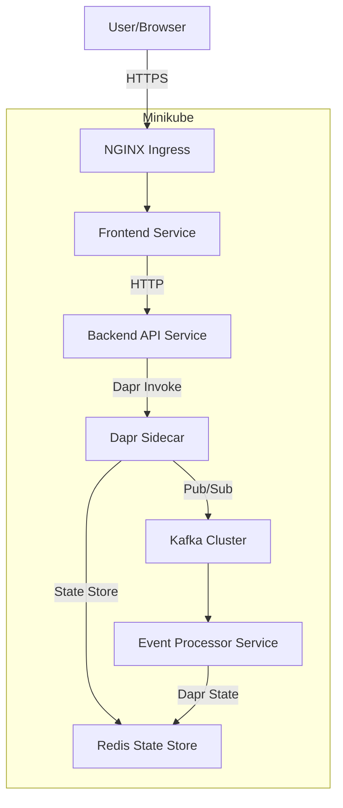

---

## Architecture Decisions

### ADR-001: Kafka Hosting Choice

**Decision**: Use **Bitnami Kafka Helm chart** for Phase IV (Minikube), **Confluent Cloud** for Phase V (Production)

**Rationale**:
- Bitnami: Lightweight, well-maintained, easy to install on Minikube
- Confluent Cloud: Managed service, reduces ops overhead in production
- Kafka-compatible APIs ensure no code changes between environments

**Alternatives Considered**:
- Redpanda: Lighter but less mature ecosystem
- Strimzi: More complex operator-based approach
- Self-managed: Too much ops overhead for Phase IV

---

### ADR-002: Dapr State Backend

**Decision**: Use **Redis** for Dapr state store (both Phase IV and V)

**Rationale**:
- Native Dapr support (first-class citizen)
- Fast in-memory operations with persistence options
- Simpler than PostgreSQL for key-value state
- Azure Cache for Redis / Memorystore available in production

**Alternatives Considered**:
- PostgreSQL: Better for complex queries but more complex setup
- MongoDB: Document store not needed for current use cases
- In-memory: Not suitable for production (data loss on restart)

---

### ADR-003: Monitoring Stack

**Decision**: Use **Prometheus + Grafana + Jaeger** (self-hosted for Phase IV, managed options for Phase V)

**Rationale**:
- CNCF standard tools
- Dapr has built-in Prometheus metrics
- OpenTelemetry integration for tracing
- Grafana dashboards easy to create and share

**Phase V Options**:
- Azure: Azure Monitor (managed Prometheus) + Grafana
- GCP: Cloud Monitoring + Grafana
- Multi-cloud: Grafana Cloud (managed)

---

### ADR-004: Logging Solution

**Decision**: Use **Fluent Bit + Loki** for log aggregation

**Rationale**:
- Lightweight (Fluent Bit written in C)
- Loki integrates well with Grafana
- Lower cost than ELK stack
- Sufficient for Phase IV/V requirements

**Alternatives Considered**:
- ELK Stack: More powerful but heavier resource usage
- Managed logging: Vendor lock-in concern
- stdout only: Not sufficient for production debugging

---

### ADR-005: Single-User Architecture

**Decision**: Start with **single-user** architecture (consistent with Phase I-III), design for multi-tenant future

**Rationale**:
- Maintains consistency with existing phases
- Simpler implementation
- Faster time to market
- Event schemas include `user_id` for future multi-tenant support

**Future Multi-Tenant Path**:
- Add `tenant_id` to event schemas
- Implement authentication layer
- Add user isolation at service level

---

## Service Boundaries

### Microservices Architecture

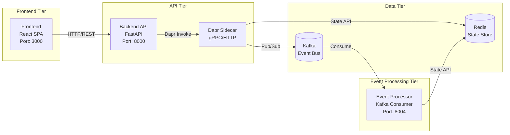

### Service Responsibility Matrix

| Service | Responsibility | Technology | Port | Dapr App ID |
|---------|---------------|------------|------|-------------|
| **Frontend** | UI, chat interface, task display | React + Nginx | 3000 | todo-frontend |
| **Backend API** | REST API, request validation, event publishing | FastAPI + Dapr SDK | 8000 | todo-backend |
| **Event Processor** | Event consumption, state persistence, projections | FastAPI + Dapr SDK | 8004 | todo-events |

### Service Communication Patterns

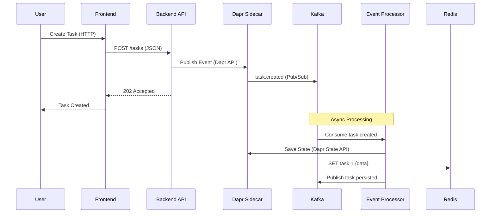

---

## Scaling Strategy

### Horizontal Pod Autoscaler (HPA) Configuration

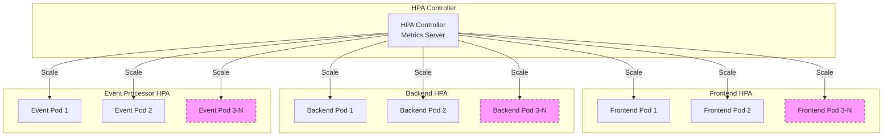

### Scaling Configuration Table

| Service | Min Replicas | Max Replicas | CPU Target | Memory Target | Scale-Up Cooldown | Scale-Down Cooldown |
|---------|-------------|--------------|------------|---------------|-------------------|---------------------|
| Frontend | 2 | 4 | 70% | 80% | 60s | 300s |
| Backend API | 2 | 10 | 70% | 80% | 60s | 300s |
| Event Processor | 2 | 6 | 70% | 80% | 60s | 300s |

### Scaling Triggers

```yaml
# Example HPA manifest
apiVersion: autoscaling/v2
kind: HorizontalPodAutoscaler
metadata:
  name: todo-backend-hpa
spec:
  scaleTargetRef:
    apiVersion: apps/v1
    kind: Deployment
    name: todo-backend
  minReplicas: 2
  maxReplicas: 10
  metrics:
  - type: Resource
    resource:
      name: cpu
      target:
        type: Utilization
        averageUtilization: 70
  - type: Resource
    resource:
      name: memory
      target:
        type: Utilization
        averageUtilization: 80
  behavior:
    scaleDown:
      stabilizationWindowSeconds: 300
      policies:
      - type: Percent
        value: 50
        periodSeconds: 60
    scaleUp:
      stabilizationWindowSeconds: 60
      policies:
      - type: Percent
        value: 100
        periodSeconds: 60
```

---

## Event Flow Architecture

### Event Publishing Flow

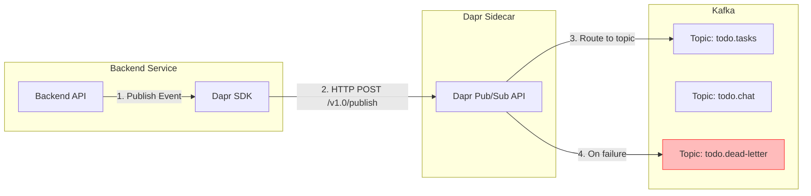

### Event Consumption Flow

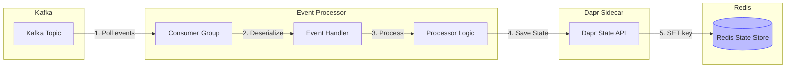

### Event Topics and Partitions

| Topic | Partitions | Replication Factor | Retention | Consumer Groups |
|-------|-----------|-------------------|-----------|-----------------|
| `todo.tasks` | 3 | 1 | 7 days | event-processor-group |
| `todo.chat` | 3 | 1 | 7 days | chat-processor-group |
| `todo.dead-letter` | 1 | 1 | 30 days | dlq-monitor-group |

### Event Schema (CloudEvents 1.0)

```json
{
  "specversion": "1.0",
  "type": "com.todo.task.created",
  "source": "/todo-backend",
  "id": "uuid-v4",
  "time": "2026-03-12T10:30:00Z",
  "datacontenttype": "application/json",
  "subject": "task:1",
  "partitionkey": "user-123",
  "data": {
    "task_id": 1,
    "title": "Buy milk",
    "description": "From grocery store",
    "status": "pending",
    "created_by": "user-123",
    "created_at": "2026-03-12T10:30:00Z"
  }
}
```

---

## Failover Handling

### Pod Failure Recovery

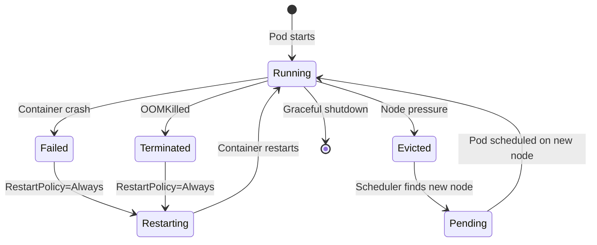

### Kafka Consumer Failover

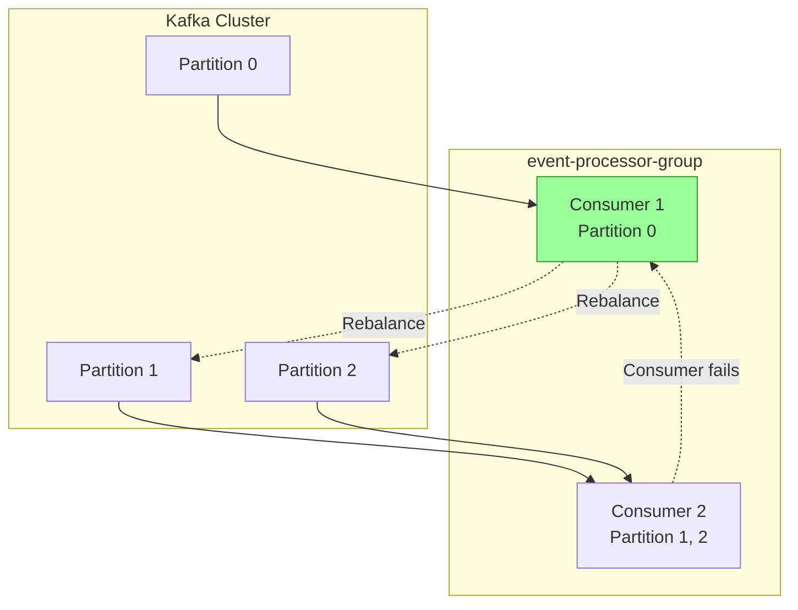

### Failover Strategies

| Failure Type | Detection | Recovery Strategy | RTO | RPO |
|-------------|-----------|-------------------|-----|-----|
| Pod crash | Kubernetes liveness probe | Automatic restart (RestartPolicy=Always) | <30s | 0 |
| Node failure | Node not ready | Pod rescheduled on different node | <2min | 0 |
| Kafka broker failure | Connection timeout | Retry with backoff, failover to replica | <1min | <1min |
| Redis failure | Connection timeout | Retry, circuit breaker opens | <30s | 0 |
| Dapr sidecar failure | Health check fails | Sidecar restarts with pod | <30s | 0 |

### Circuit Breaker Pattern

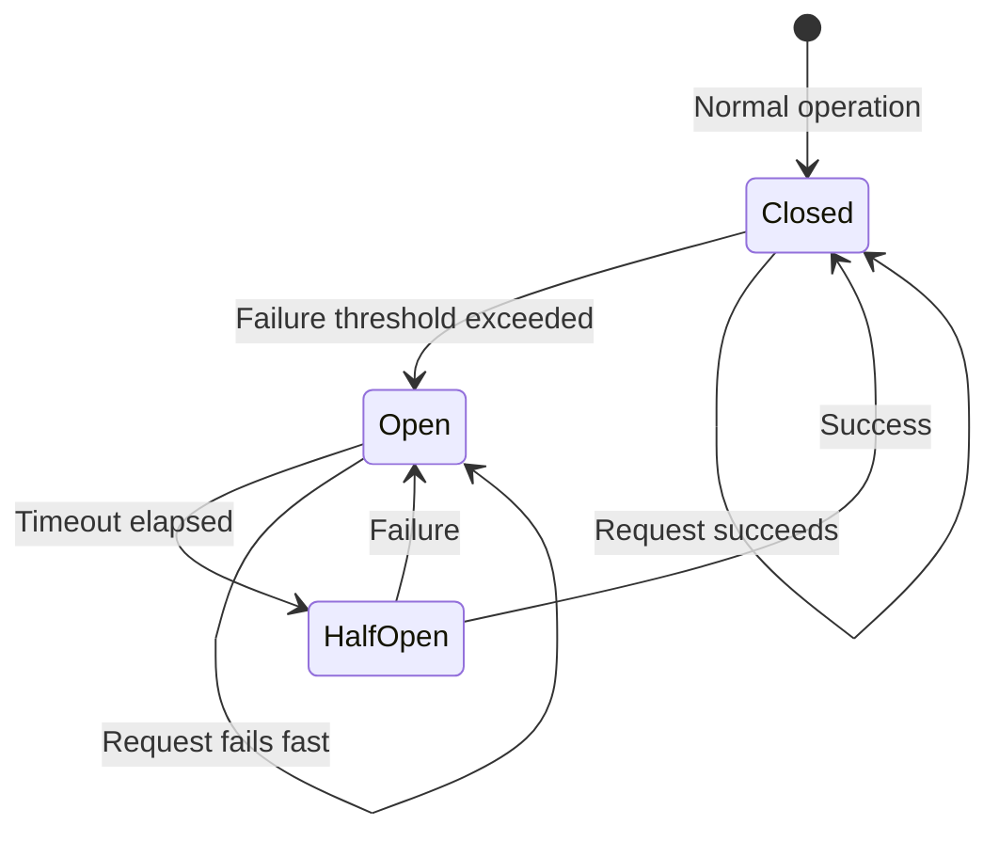

---

## Kubernetes Services and Ingress

### Service Architecture

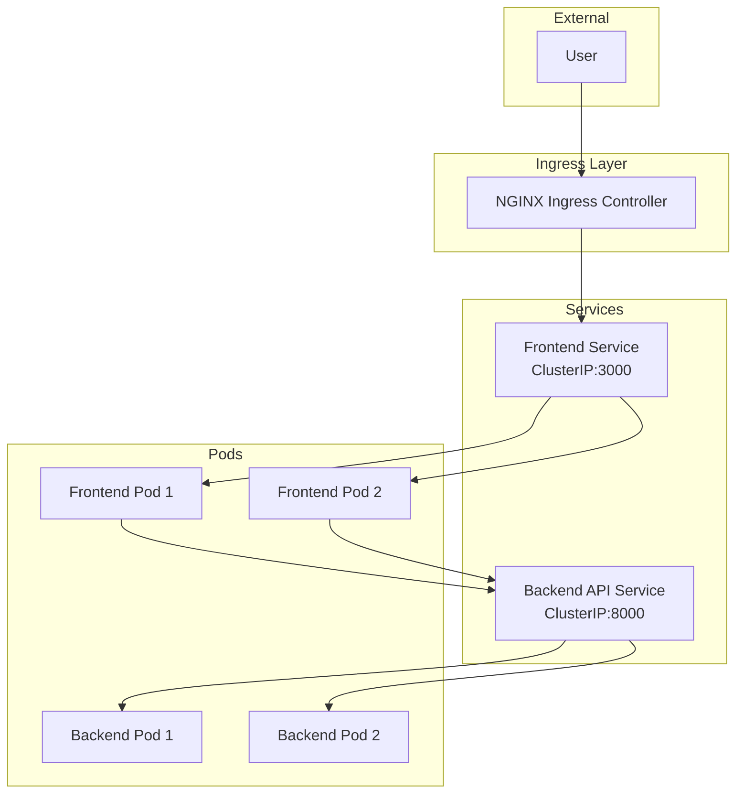

### Ingress Configuration

```yaml
apiVersion: networking.k8s.io/v1
kind: Ingress
metadata:
  name: todo-ingress
  annotations:
    nginx.ingress.kubernetes.io/rewrite-target: /
    nginx.ingress.kubernetes.io/ssl-redirect: "true"
spec:
  ingressClassName: nginx
  rules:
  - host: todo.local
    http:
      paths:
      - path: /
        pathType: Prefix
        backend:
          service:
            name: todo-frontend
            port:
              number: 80
      - path: /api
        pathType: Prefix
        backend:
          service:
            name: todo-backend
            port:
              number: 8000
```

### Service Types

| Service Name | Type | Port | Target Port | Selector |
|-------------|------|------|-------------|----------|
| todo-frontend | ClusterIP | 80 | 3000 | app=todo-frontend |
| todo-backend | ClusterIP | 8000 | 8000 | app=todo-backend |
| kafka-headless | Headless | 9092 | 9092 | app=kafka |
| redis-master | ClusterIP | 6379 | 6379 | app=redis,role=master |

---

## Secrets Management

### Secrets Architecture

```mermaid
graph TB
    subgraph Kubernetes
        KS[Kubernetes Secrets]
    end
    
    subgraph Dapr
        DS[Dapr Secret Store Component]
    end
    
    subgraph Services
        BE[Backend Service]
        EP[Event Processor]
    end
    
    subgraph External Secrets
        RedisPwd[Redis Password]
        KafkaCreds[Kafka Credentials]
        JWTKey[JWT Secret Key]
    end
    
    External Secrets --> KS
    KS --> DS
    DS -->|Dapr Secret API| BE
    DS -->|Dapr Secret API| EP
```

### Secret Types and Storage

| Secret Name | Keys | Storage | Access Method |
|-------------|------|---------|---------------|
| redis-secret | password | Kubernetes Secret | Dapr Secret Store |
| kafka-secret | username, password | Kubernetes Secret | Dapr Secret Store |
| jwt-secret | key | Kubernetes Secret | Environment Variable (non-sensitive hash) |
| tls-secret | tls.crt, tls.key | Kubernetes Secret | Ingress TLS |

### Dapr Secret Store Component

```yaml
apiVersion: dapr.io/v1alpha1
kind: Component
metadata:
  name: kubernetes-secrets
spec:
  type: secretstores.kubernetes
  version: v1
  auth:
    secret:
      name: k8s-secret
```

### Application Access Pattern

```python
# Backend service retrieves secret via Dapr
from dapr.clients import DaprClient

with DaprClient() as client:
    secret = client.get_secret(
        store_name='kubernetes-secrets',
        key='redis-password'
    )
    redis_password = secret.secret
```

---

## CI/CD Flow

### Pipeline Architecture

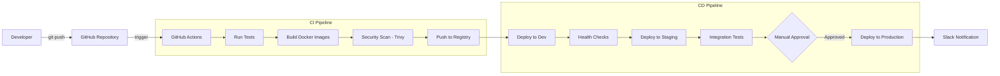

### GitHub Actions Workflow Structure

```yaml
name: CI/CD Pipeline

on:
  push:
    branches: [main, develop]
  pull_request:
    branches: [main]

jobs:
  test:
    # Unit tests, integration tests
    steps: [checkout, setup-python, install-deps, run-tests]
  
  build:
    needs: test
    steps: [checkout, build-images, push-to-registry]
  
  security-scan:
    needs: build
    steps: [trivy-scan, upload-sarif]
  
  deploy-dev:
    needs: [build, security-scan]
    if: github.ref == 'refs/heads/develop'
    steps: [setup-minikube, install-dapr, helm-deploy, health-check]
  
  deploy-staging:
    needs: deploy-dev
    if: github.ref == 'refs/heads/main'
    steps: [helm-deploy-staging, integration-tests]
  
  deploy-prod:
    needs: deploy-staging
    environment: production
    steps: [helm-deploy-prod, smoke-tests, slack-notify]
```

### Deployment Strategy

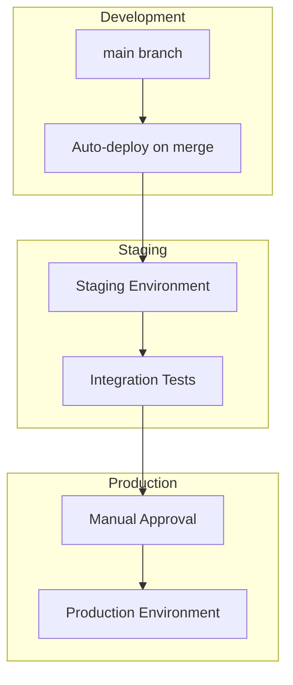

---

## Helm Charts Structure

### Chart Directory Layout

```
charts/
└── todo-app/
    ├── Chart.yaml                  # Chart metadata (version, app version, dependencies)
    ├── values.yaml                 # Default configuration values
    ├── values-dev.yaml             # Development environment overrides
    ├── values-staging.yaml         # Staging environment overrides
    ├── values-prod.yaml            # Production environment overrides
    ├── charts/                     # Subcharts (if any)
    └── templates/
        ├── _helpers.tpl            # Template helper functions
        ├── NOTES.txt               # Post-install notes
        ├── namespace.yaml          # Namespace definition
        ├── dapr-components/
        │   ├── pubsub-kafka.yaml   # Dapr pub/sub component
        │   ├── state-redis.yaml    # Dapr state store component
        │   └── secret-k8s.yaml     # Dapr secret store component
        ├── services/
        │   ├── frontend/
        │   │   ├── deployment.yaml
        │   │   ├── service.yaml
        │   │   ├── hpa.yaml
        │   │   ├── configmap.yaml
        │   │   ├── probes.yaml
        │   │   └── networkpolicy.yaml
        │   ├── backend/
        │   │   ├── deployment.yaml
        │   │   ├── service.yaml
        │   │   ├── hpa.yaml
        │   │   ├── configmap.yaml
        │   │   ├── probes.yaml
        │   │   └── networkpolicy.yaml
        │   └── event-processor/
        │       ├── deployment.yaml
        │       ├── service.yaml
        │       ├── hpa.yaml
        │       └── configmap.yaml
        ├── infrastructure/
        │   ├── ingress.yaml
        │   ├── networkpolicies.yaml
        │   └── rbac.yaml
        └── observability/
            ├── prometheus-servicemonitor.yaml
            ├── grafana-dashboards-configmap.yaml
            └── jaeger.yaml
```

### Chart Dependencies

```yaml
# Chart.yaml
apiVersion: v2
name: todo-app
description: Cloud-Native Todo Chatbot Application
type: application
version: 1.0.0
appVersion: "4.0.0"

dependencies:
- name: kafka
  version: 22.1.0
  repository: https://charts.bitnami.com/bitnami
  condition: kafka.enabled
- name: redis
  version: 18.0.0
  repository: https://charts.bitnami.com/bitnami
  condition: redis.enabled
- name: dapr
  version: 1.12.0
  repository: https://dapr.github.io/helm-charts/
  condition: dapr.enabled
```

---

## Migration Strategy from Minikube to AKS/GKE

### Migration Phases

```mermaid
graph LR
    subgraph Phase 1 [Preparation]
        P1[Create Cloud Infrastructure]
        P2[Configure Helm Values]
        P3[Setup CI/CD]
    end
    
    subgraph Phase 2 [Parallel Run]
        P4[Deploy to Cloud]
        P5[Run Smoke Tests]
        P6[Sync Data]
    end
    
    subgraph Phase 3 [Cutover]
        P7[Update DNS]
        P8[Switch Traffic]
        P9[Monitor]
    end
    
    subgraph Phase 4 [Decommission]
        P10[Verify Cloud Stable]
        P11[Shutdown Minikube]
    end
    
    P1 --> P2 --> P3 --> P4 --> P5 --> P6 --> P7 --> P8 --> P9 --> P10 --> P11
```

### Configuration Changes Matrix

| Component | Minikube | AKS | GKE |
|-----------|----------|-----|-----|
| **Ingress Class** | nginx | azure/application-gateway | gce |
| **State Store** | Redis Helm | Azure Cache for Redis | Memorystore |
| **Kafka** | Bitnami Helm | Confluent Cloud | Confluent Cloud |
| **Secret Store** | Kubernetes Secrets | Azure Key Vault | GCP Secret Manager |
| **Monitoring** | Prometheus Helm | Azure Monitor | Cloud Monitoring |
| **Logging** | Loki Helm | Azure Log Analytics | Cloud Logging |
| **Load Balancer** | MetalLB | Azure Load Balancer | GCP Load Balancer |

### Migration Checklist

```markdown
## Pre-Migration
- [ ] Terraform scripts for AKS/GKE cluster
- [ ] Cloud-specific Helm values files created
- [ ] CI/CD pipeline updated for cloud deployment
- [ ] DNS records identified for update
- [ ] Monitoring baselines established

## Migration Execution
- [ ] Deploy application to cloud Kubernetes
- [ ] Run smoke tests against cloud deployment
- [ ] Verify all health checks passing
- [ ] Update DNS TTL to minimum (5 min)
- [ ] Switch DNS to cloud ingress IP
- [ ] Monitor error rates and latency

## Post-Migration
- [ ] Verify 100% traffic on cloud
- [ ] Monitor for 24 hours
- [ ] Update documentation
- [ ] Schedule Minikube decommission
```

### Rollback Strategy

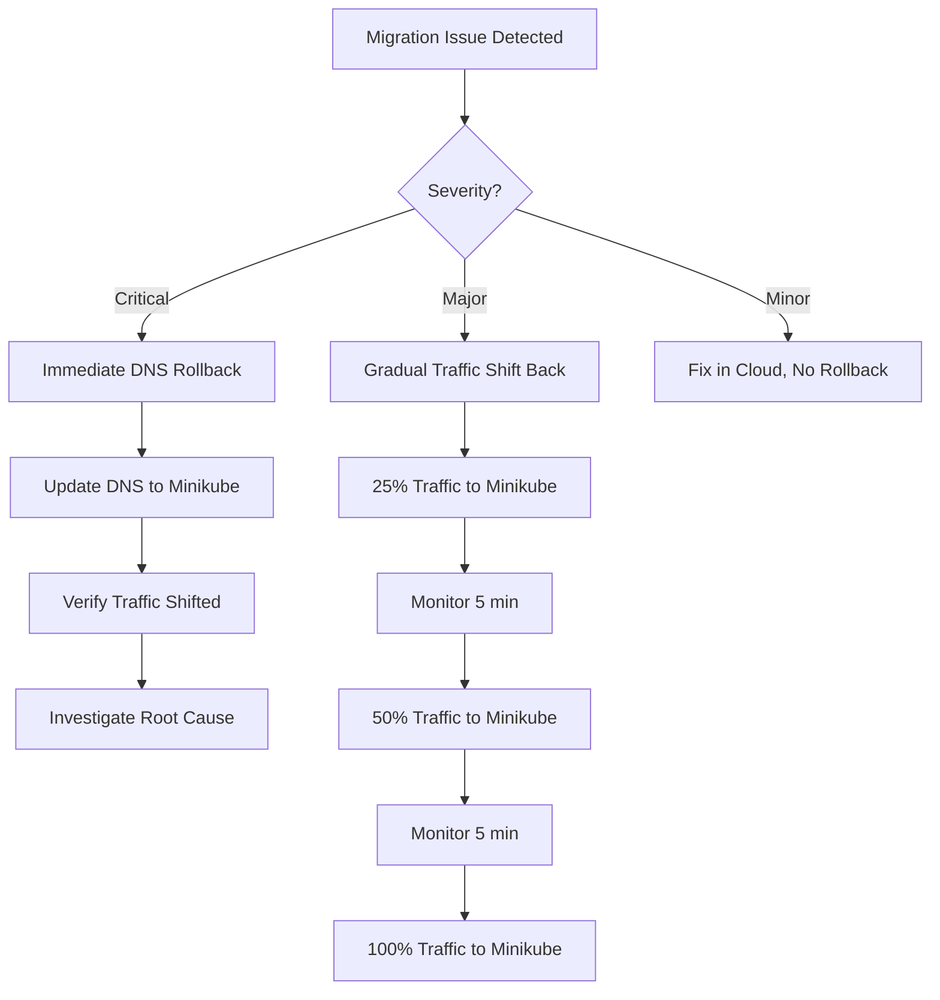

---

## Acceptance Criteria

### Architecture Validation

- [ ] All services have clear boundaries and responsibilities
- [ ] HPA configured for all services with appropriate thresholds
- [ ] Event flow documented with CloudEvents schema
- [ ] Failover handling tested for all failure scenarios
- [ ] Migration strategy documented and tested

### Technical Validation

- [ ] Helm chart passes lint validation
- [ ] Kubernetes manifests pass kubeval/kubeconform
- [ ] Dapr components properly configured
- [ ] Secrets management follows security best practices
- [ ] CI/CD pipeline executes successfully

### Operational Validation

- [ ] Monitoring dashboards created and accessible
- [ ] Alert rules configured and tested
- [ ] Runbooks documented for common scenarios
- [ ] Team trained on new architecture

---

**Version**: 1.0.0  
**Created**: 2026-03-12  
**Next**: Implementation Tasks (`phase-iv-tasks.md`)
