# Phase V: Advanced Cloud Architecture Plan

## Document Information

**Phase**: Phase V (Advanced Cloud Deployment)  
**Version**: 1.0.0  
**Created**: 2026-03-12  
**Status**: Draft  
**Constitution**: `.specify/memory/phase-iv-v-constitution.md`  
**Specification**: `specs/features/phase-v-advanced-cloud.md`  
**Prerequisite**: Phase IV (`phase-iv-plan.md`)

---

## Architecture Overview

### System Context Diagram (Phase V)

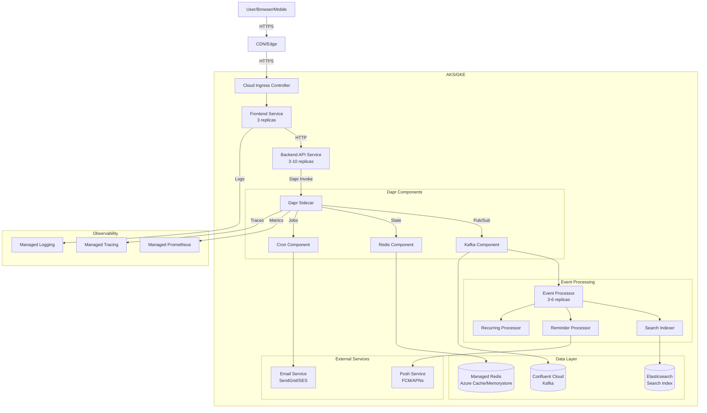

---

## Architecture Decisions (Phase V)

### ADR-V-001: Cloud Provider Selection

**Decision**: **Azure AKS** as primary target (with GKE support as secondary)

**Rationale**:
- Enterprise integration capabilities
- Azure DevOps/GitHub Actions seamless integration
- Azure Monitor provides managed Prometheus/Grafana
- Cost-effective for startup phase
- Azure Cache for Redis integrates natively with Dapr

**GKE Alternative** (if team has GCP preference):
- GKE is more Kubernetes-native
- Better integration with GCP data tools
- Similar cost structure

**Multi-Cloud** (future consideration):
- Helm values abstraction enables cloud switching
- Dapr components abstract cloud-specific services
- No code changes required for cloud migration

---

### ADR-V-002: Advanced Features Architecture

**Decision**: Implement recurring tasks, due dates, reminders, priority, tags, search, filter using **event-driven architecture**

**Rationale**:
- Consistent with Phase IV event-driven approach
- Each feature publishes/consumes events
- Decoupled processing enables independent scaling
- Dapr Jobs API handles scheduling (reminders, recurring)

**Feature Implementation Strategy**:
- **Recurring Tasks**: RRULE parsing + Dapr Cron binding
- **Due Dates**: Stored in task state, queried via Elasticsearch
- **Reminders**: Dapr Cron → Reminder Processor → Email/Push
- **Priority/Tags**: Metadata in events, indexed in Elasticsearch
- **Search**: Elasticsearch with analyzer for full-text search
- **Filter**: Query Elasticsearch with filters

---

### ADR-V-003: Search Implementation

**Decision**: Use **Elasticsearch** for full-text search and advanced filtering

**Rationale**:
- Industry standard for full-text search
- Sub-100ms query latency
- Advanced filtering capabilities
- Scales horizontally
- Dapr can integrate via state store or direct API

**Alternatives Considered**:
- PostgreSQL full-text search: Simpler but limited scalability
- Algolia: Managed but expensive at scale
- Meilisearch: Lightweight but less mature

---

### ADR-V-004: Dapr Jobs API for Scheduling

**Decision**: Use **Dapr Cron Binding** for scheduled tasks (reminders, recurring)

**Rationale**:
- Native Dapr integration
- No external scheduler needed
- Kubernetes-native (uses cluster time)
- Scales with application

**Implementation**:
- Cron component triggers every minute
- Reminder Processor checks for due reminders
- Recurring Processor checks for recurring task instances

**Alternatives Considered**:
- Kubernetes CronJobs: Less flexible, harder to scale
- Quartz scheduler: Java-only, complex
- Temporal.io: Overkill for simple scheduling

---

### ADR-V-005: Production CI/CD Strategy

**Decision**: **GitHub Flow** with manual approval for production

**Rationale**:
- Simple branching model (main + feature branches)
- Fast iteration for development
- Manual approval gate for production safety
- Environment protection rules in GitHub

**Pipeline Flow**:
```
Feature Branch → PR → Tests → Merge to main → Deploy Dev → Auto-deploy Staging → Manual Approval → Deploy Production
```

---

### ADR-V-006: Managed Services over Self-Hosted

**Decision**: Use **managed services** for production (Confluent Cloud, Azure Cache, Azure Monitor)

**Rationale**:
- Reduces operational overhead
- Built-in high availability
- Automatic backups and patching
- SLA guarantees
- Team can focus on application logic

**Cost Trade-off**:
- Higher cost than self-hosted (~$500-800/month vs ~$200-300/month)
- Lower operational risk
- Faster time to market
- Better reliability

---

## Service Boundaries (Phase V)

### Extended Microservices Architecture

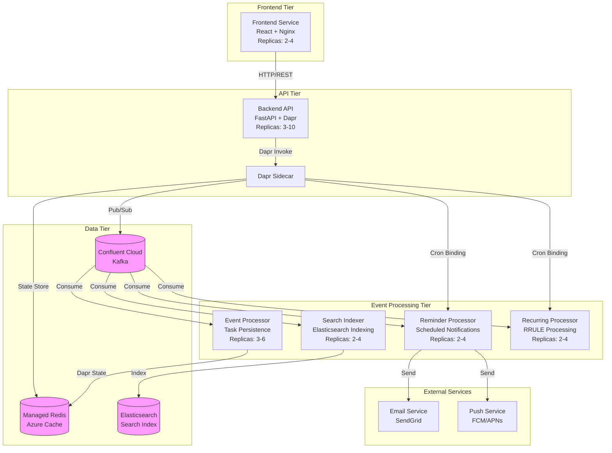

### Service Responsibility Matrix (Phase V)

| Service | Responsibility | Technology | Replicas | Scaling Trigger |
|---------|---------------|------------|----------|-----------------|
| **Frontend** | UI, chat interface, search UI, filters | React + Nginx | 2-4 | CPU > 70% |
| **Backend API** | REST API, validation, event publishing | FastAPI + Dapr | 3-10 | CPU > 70%, RPS |
| **Event Processor** | Task persistence, projections | FastAPI + Dapr | 3-6 | Kafka lag |
| **Search Indexer** | Elasticsearch indexing, search queries | FastAPI + ES | 2-4 | Kafka lag, search RPS |
| **Reminder Processor** | Reminder scheduling, email/push notifications | FastAPI + Dapr Cron | 2-4 | Dapr Cron trigger |
| **Recurring Processor** | RRULE parsing, recurring instance creation | FastAPI + Dapr Cron | 2-4 | Dapr Cron trigger |

### New Service Boundaries (Phase V Features)

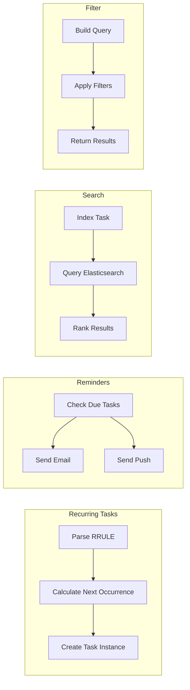

---

## Scaling Strategy (Phase V)

### Multi-Dimensional Scaling

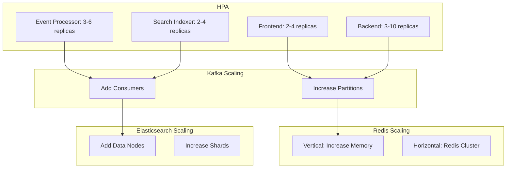

### Scaling Configuration Table (Phase V)

| Service | Min Replicas | Max Replicas | CPU Target | Memory Target | Custom Metrics |
|---------|-------------|--------------|------------|---------------|----------------|
| Frontend | 2 | 4 | 70% | 80% | - |
| Backend API | 3 | 10 | 70% | 80% | RPS > 500 |
| Event Processor | 3 | 6 | 70% | 80% | Kafka lag > 100 |
| Search Indexer | 2 | 4 | 70% | 80% | Kafka lag > 50 |
| Reminder Processor | 2 | 4 | 70% | 80% | - |
| Recurring Processor | 2 | 4 | 70% | 80% | - |

### Kafka Partition Scaling

```mermaid
graph LR
    subgraph Initial State
        P1[Partition 0<br/>Consumer A]
        P2[Partition 1<br/>Consumer B]
        P3[Partition 2<br/>Consumer C]
    end
    
    subgraph After Scaling
        P1 --> P4[Partition 0<br/>Consumer A]
        P2 --> P5[Partition 1<br/>Consumer B]
        P3 --> P6[Partition 2<br/>Consumer C]
        P3 --> P7[Partition 3<br/>Consumer D]
    end
    
    Initial State -.->|Add Partition| After Scaling
```

### Elasticsearch Scaling Strategy

| Metric | Threshold | Action |
|--------|-----------|--------|
| Index size | >50GB | Add data node |
| Query latency (P95) | >100ms | Increase shards |
| Heap usage | >75% | Vertical scale (more RAM) |
| Disk usage | >80% | Add data node |

---

## Event Flow Architecture (Phase V)

### Extended Event Topics

| Topic | Partitions | Retention | Purpose | Producers | Consumers |
|-------|-----------|-----------|---------|-----------|-----------|
| `todo.tasks` | 6 | 30 days | Task CRUD events | Backend API | Event Processor, Search Indexer |
| `todo.tasks.recurrence` | 3 | 30 days | Recurring task events | Recurring Processor | Event Processor |
| `todo.reminders` | 6 | 30 days | Reminder events | Reminder Processor | Email/Push Services |
| `todo.search` | 3 | 7 days | Search indexing events | Search Indexer | - |
| `todo.notifications` | 6 | 30 days | Notification events | Reminder Processor | External Services |
| `todo.chat` | 3 | 30 days | Chat message events | Backend API | AI Agent |
| `todo.audit` | 3 | 90 days | Audit log events | All Services | Audit Service |
| `todo.dead-letter` | 3 | 90 days | Failed events | Dapr | DLQ Monitor |

### Event Flow: Recurring Task Creation

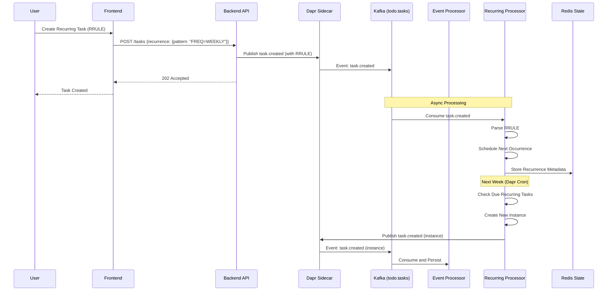

### Event Flow: Reminder Trigger

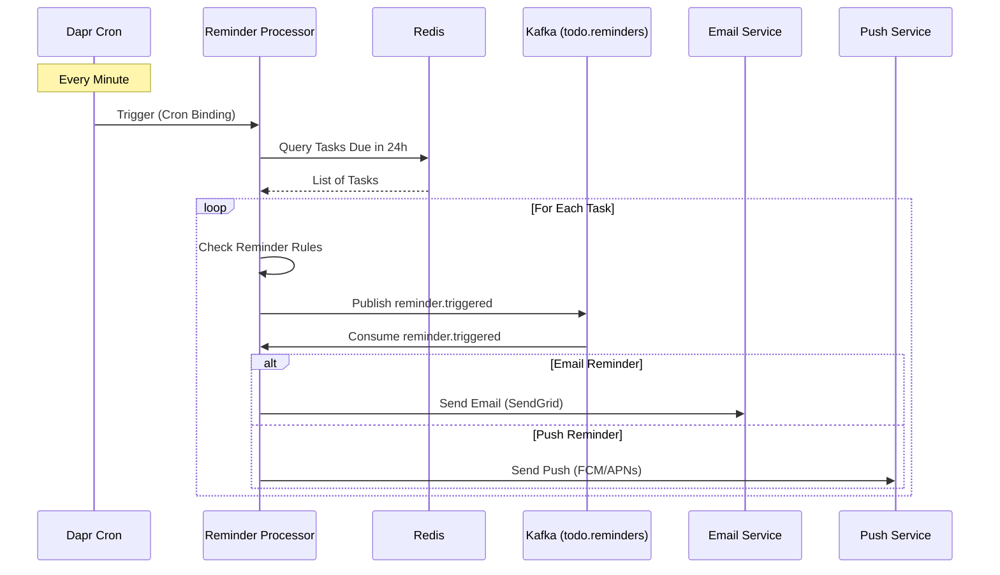

### Event Flow: Search Indexing

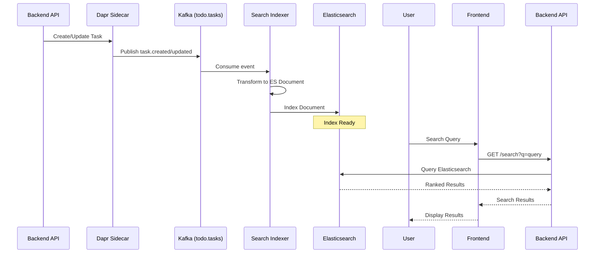

---

## Failover Handling (Phase V)

### Multi-Zone High Availability

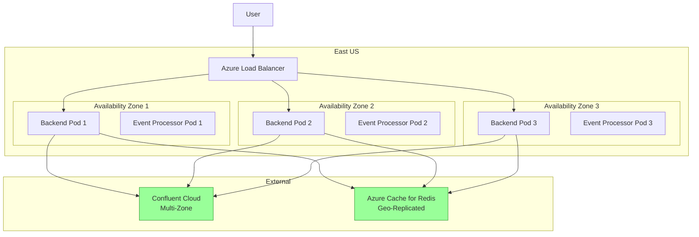

### Confluent Cloud Failover

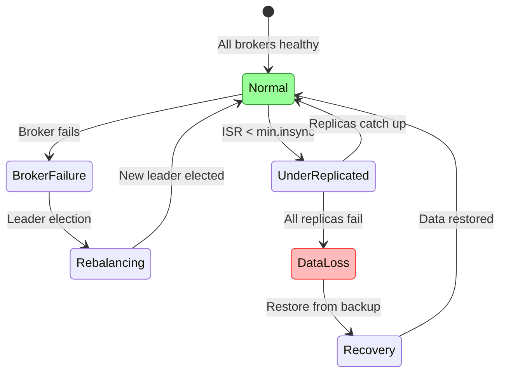

### Redis Failover (Azure Cache)

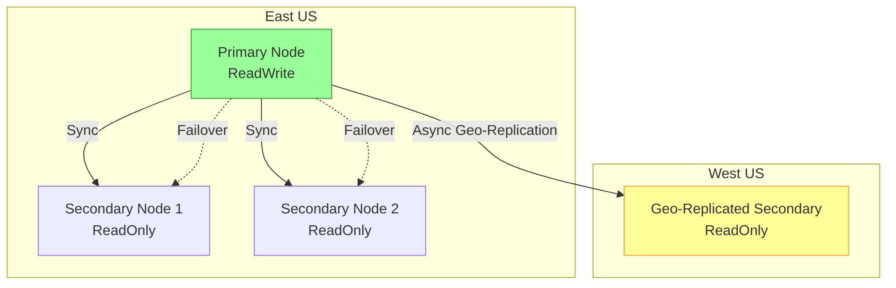

### Circuit Breaker Configuration (Phase V)

```yaml
# Dapr Resiliency Configuration
apiVersion: resiliency.dapr.io/v1alpha1
kind: Resiliency
metadata:
  name: todo-resiliency
spec:
  policies:
    circuitBreakers:
      kafkaCB:
        timeout: 30s
        numRequests: 10
        halfOpenRequests: 3
        trip: 5
      redisCB:
        timeout: 10s
        numRequests: 5
        halfOpenRequests: 2
        trip: 3
    retries:
      kafkaRetry:
        policy: exponential
        maxRetries: 5
        maxInterval: 30s
      redisRetry:
        policy: constant
        maxRetries: 3
        interval: 1s
  targets:
    components:
      kafka-pubsub:
        outbound:
          retry: kafkaRetry
          circuitBreaker: kafkaCB
      redis-state:
        outbound:
          retry: redisRetry
          circuitBreaker: redisCB
```

---

## Kubernetes Services and Ingress (Phase V)

### Cloud Ingress Architecture (AKS)

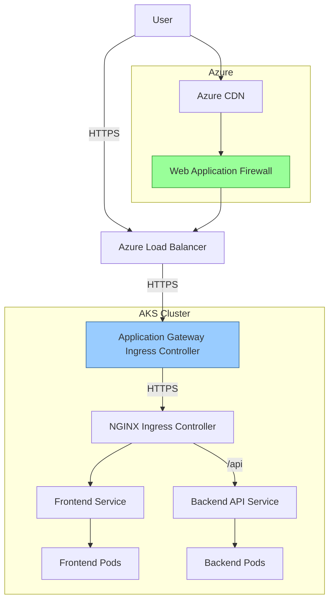

### Application Gateway Ingress Configuration (AKS)

```yaml
apiVersion: networking.k8s.io/v1
kind: Ingress
metadata:
  name: todo-ingress
  annotations:
    kubernetes.io/ingress.class: azure/application-gateway
    appgw.ingress.kubernetes.io/ssl-redirect: "true"
    appgw.ingress.kubernetes.io/backend-protocol: "HTTPS"
    cert-manager.io/cluster-issuer: "letsencrypt-prod"
spec:
  tls:
  - hosts:
    - todo.example.com
    secretName: todo-tls-secret
  rules:
  - host: todo.example.com
    http:
      paths:
      - path: /
        pathType: Prefix
        backend:
          service:
            name: todo-frontend
            port:
              number: 80
      - path: /api
        pathType: Prefix
        backend:
          service:
            name: todo-backend
            port:
              number: 8000
      - path: /health
        pathType: Prefix
        backend:
          service:
            name: todo-backend
            port:
              number: 8000
```

### GKE Ingress Architecture (Alternative)

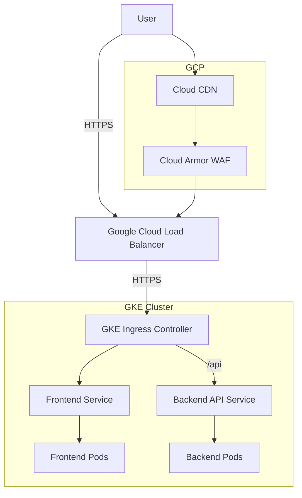

---

## Secrets Management (Phase V)

### Azure Key Vault Integration

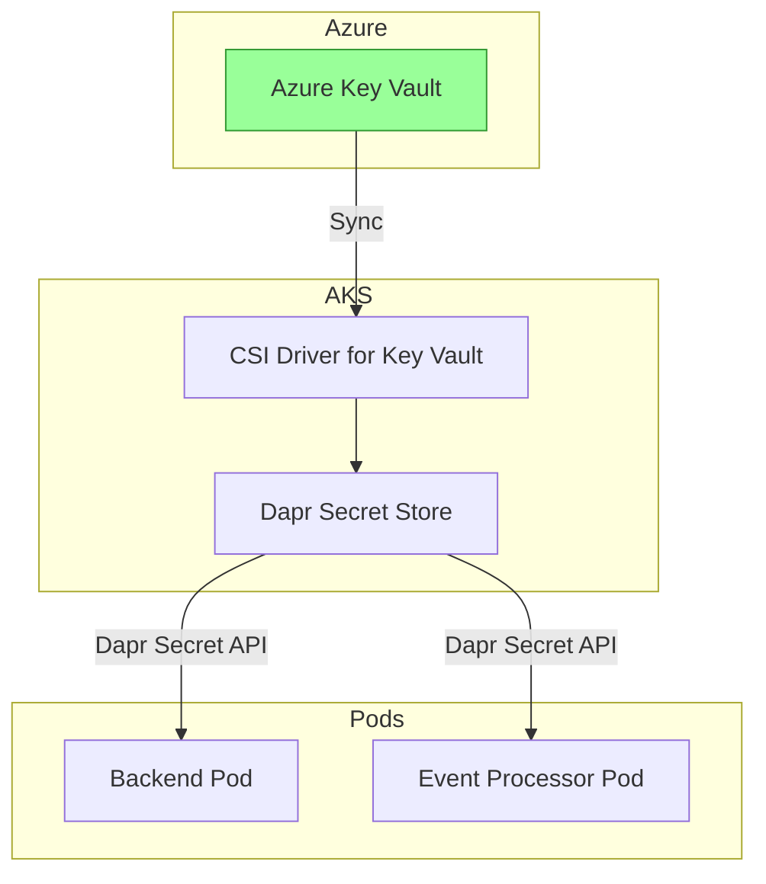

### Dapr Secret Store Component (Azure Key Vault)

```yaml
apiVersion: dapr.io/v1alpha1
kind: Component
metadata:
  name: azure-keyvault
spec:
  type: secretstores.azure.keyvault
  version: v1
  metadata:
  - name: vaultName
    value: "todo-prod-kv"
  - name: azureTenantId
    value:
      secretKeyRef:
        name: azure-credentials
        key: tenant-id
  - name: azureClientId
    value:
      secretKeyRef:
        name: azure-credentials
        key: client-id
  - name: azureCertificateFile
    value: "/mnt/secrets-store/cert.pem"
  - name: azureCertificatePassword
    value: ""
auth:
  secret:
    name: azure-credentials
```

### Secrets Inventory (Phase V)

| Secret Name | Keys | Storage | Rotation Policy |
|-------------|------|---------|-----------------|
| redis-secret | password | Azure Key Vault | 90 days (auto) |
| kafka-secret | username, password | Azure Key Vault | 90 days (auto) |
| sendgrid-secret | api-key | Azure Key Vault | Manual |
| fcm-secret | service-account-key | Azure Key Vault | Manual |
| tls-secret | tls.crt, tls.key | cert-manager (Let's Encrypt) | 90 days (auto) |
| jwt-secret | signing-key | Azure Key Vault | 180 days |

---

## CI/CD Flow (Phase V)

### Production CI/CD Pipeline

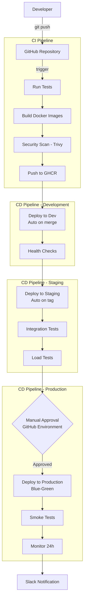

### Blue-Green Deployment Strategy

```mermaid
graph LR
    subgraph Current State
        Green[Green Environment<br/>Active Traffic]
        Blue[Blue Environment<br/>Idle]
    end
    
    subgraph Deployment
        Deploy[Deploy to Blue]
        Test[Test Blue]
    end
    
    subgraph Switch
        Switch[Switch Traffic<br/>Blue → Active]
    end
    
    subgraph New State
        Blue2[Blue Environment<br/>Active Traffic]
        Green2[Green Environment<br/>Idle]
    end
    
    Current State --> Deployment --> Switch --> New State
    
    style Green fill:#9f9,stroke:#393
    style Blue2 fill:#9f9,stroke:#393
```

### GitHub Environment Configuration

```yaml
# GitHub Repository Settings
environments:
  development:
    protection_rules:
      - type: branch_policy
        branches: [develop]
  staging:
    protection_rules:
      - type: required_reviewers
        reviewers: 1
      - type: wait_timer
        minutes: 5
  production:
    protection_rules:
      - type: required_reviewers
        reviewers: 2
      - type: wait_timer
        minutes: 15
      - type: prevent_self_review
        enabled: true
    deployment_branch_policy:
      protected_branches: true
```

---

## Helm Charts Structure (Phase V)

### Extended Chart Structure

```
charts/
└── todo-app/
    ├── Chart.yaml
    ├── values.yaml
    ├── values-dev.yaml
    ├── values-staging.yaml
    ├── values-aks.yaml            # Azure AKS specific
    ├── values-gke.yaml            # Google GKE specific
    └── templates/
        ├── _helpers.tpl
        ├── namespace.yaml
        ├── dapr-components/
        │   ├── pubsub-kafka.yaml
        │   ├── state-redis.yaml
        │   ├── secret-keyvault.yaml
        │   └── binding-cron.yaml   # NEW: Dapr Cron binding
        ├── services/
        │   ├── frontend/
        │   ├── backend/
        │   ├── event-processor/
        │   ├── search-indexer/     # NEW
        │   ├── reminder-processor/ # NEW
        │   └── recurring-processor/# NEW
        ├── infrastructure/
        │   ├── ingress.yaml
        │   ├── networkpolicies.yaml
        │   ├── rbac.yaml
        │   └── cert-manager.yaml   # NEW
        ├── observability/
        │   ├── prometheus-servicemonitor.yaml
        │   ├── grafana-dashboards-configmap.yaml
        │   ├── jaeger.yaml
        │   └── alertmanager.yaml   # NEW
        └── integrations/
            ├── azure-monitor.yaml  # NEW
            └── external-secrets.yaml # NEW
```

### Values Override Example (values-aks.yaml)

```yaml
# Azure AKS specific values
global:
  environment: production
  cloud: azure

ingress:
  class: azure-application-gateway
  host: todo.example.com
  tls:
    enabled: true
    certManager:
      enabled: true
      issuer: letsencrypt-prod

dapr:
  components:
    statestore:
      type: azure.redis
      host: todo-redis-prod.redis.cache.windows.net
      port: 6380
      ssl: true
    pubsub:
      type: kafka
      brokers:
        - "pkc-xyz123.eastus.azure.confluent.cloud:9092"
      sasl:
        enabled: true
      ssl:
        enabled: true
    secretstore:
      type: azure.keyvault
      vaultName: todo-prod-kv

search:
  enabled: true
  elasticsearch:
    host: todo-es-prod.eastus.azure.elastic-cloud.com
    port: 9243
    ssl: true

monitoring:
  azureMonitor:
    enabled: true
    workspaceId: $(AZURE_LOG_ANALYTICS_WORKSPACE_ID)
  grafana:
    enabled: true
  alertmanager:
    enabled: true
    slackWebhook: $(SLACK_WEBHOOK_URL)
    pagerdutyKey: $(PAGERDUTY_KEY)
```

---

## Migration Strategy from Minikube to AKS/GKE (Phase V)

### Phase V Migration Additions

```mermaid
graph TB
    subgraph Phase IV Migration [Infrastructure]
        M1[Migrate Kubernetes]
        M2[Migrate Dapr Components]
        M3[Migrate Kafka/Redis]
    end
    
    subgraph Phase V Migration [Features]
        M4[Migrate Task Data]
        M5[Setup Elasticsearch]
        M6[Configure Dapr Cron]
        M7[Setup Email/Push Services]
    end
    
    subgraph Validation
        M8[Feature Smoke Tests]
        M9[Load Tests]
        M10[Monitor 24h]
    end
    
    Phase IV Migration --> Phase V Migration --> Validation
```

### Data Migration Strategy

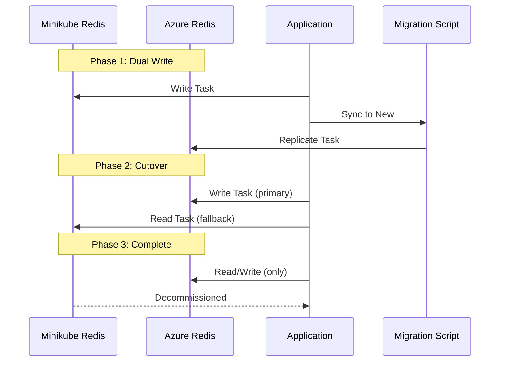

### Elasticsearch Migration

```yaml
# Migration Job
apiVersion: batch/v1
kind: Job
metadata:
  name: elasticsearch-migration
spec:
  template:
    spec:
      containers:
      - name: migrator
        image: todo-migrator:latest
        env:
        - name: SOURCE_REDIS
          value: "redis://minikube-redis:6379"
        - name: TARGET_ELASTICSEARCH
          value: "https://todo-es-prod:9243"
        command: ["/migrate-to-es.sh"]
      restartPolicy: OnFailure
```

---

## Monitoring and Observability (Phase V)

### Azure Monitor Integration

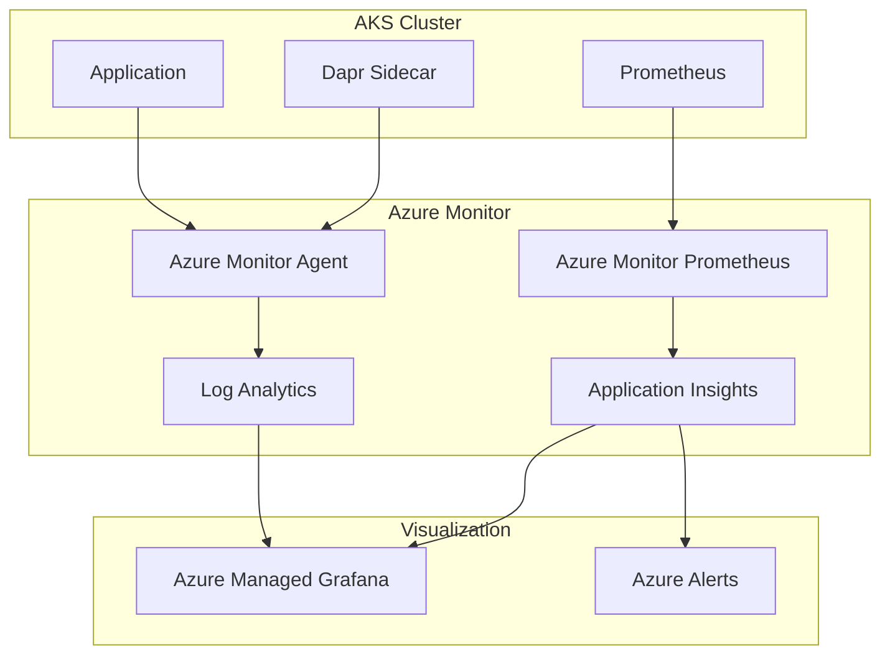

### Alert Rules (Phase V)

```yaml
# Prometheus Alert Rules
groups:
- name: todo-phase-v-alerts
  rules:
  # Business Metrics
  - alert: HighTaskCreationFailure
    expr: sum(rate(task_created_failures_total[5m])) / sum(rate(task_created_total[5m])) > 0.05
    for: 5m
    labels:
      severity: critical
    annotations:
      summary: "High task creation failure rate"
  
  - alert: ReminderDeliveryFailure
    expr: sum(rate(reminder_delivery_failures_total[1h])) > 10
    for: 15m
    labels:
      severity: warning
    annotations:
      summary: "Reminder delivery failures elevated"
  
  - alert: SearchLatencyHigh
    expr: histogram_quantile(0.95, sum(rate(search_query_duration_seconds_bucket[5m])) by (le)) > 0.1
    for: 5m
    labels:
      severity: warning
    annotations:
      summary: "Search latency P95 > 100ms"
  
  - alert: RecurringTaskProcessingDelay
    expr: time() - max(recurring_task_last_processed_timestamp) > 300
    for: 5m
    labels:
      severity: critical
    annotations:
      summary: "Recurring task processing delayed > 5 minutes"
  
  # Infrastructure Metrics
  - alert: KafkaConsumerLagCritical
    expr: sum(kafka_consumer_group_lag{group=~"event-processor.*"}) > 1000
    for: 10m
    labels:
      severity: critical
    annotations:
      summary: "Kafka consumer lag critical"
  
  - alert: ElasticsearchHeapHigh
    expr: elasticsearch_jvm_heap_used_percent > 85
    for: 5m
    labels:
      severity: warning
    annotations:
      summary: "Elasticsearch heap usage high"
```

### Grafana Dashboards (Phase V)

| Dashboard | Purpose | Panels |
|-----------|---------|--------|
| **System Overview** | High-level system health | Request rate, error rate, latency, pod status |
| **Backend API** | API performance | RPS, P50/P95/P99 latency, error rate by endpoint |
| **Event Processing** | Kafka health | Consumer lag, throughput, partition distribution |
| **Search Performance** | Elasticsearch metrics | Query latency, indexing rate, index size |
| **Reminders & Recurring** | Scheduled task health | Reminders sent, recurring instances created, failures |
| **Business Metrics** | User activity | Tasks created/completed, active users, search queries |
| **Resource Utilization** | Cluster resources | CPU/memory usage, network I/O, disk usage |

---

## Acceptance Criteria (Phase V)

### Architecture Validation

- [ ] All Phase V features have clear service boundaries
- [ ] Elasticsearch integration documented and tested
- [ ] Dapr Cron binding configured for reminders and recurring tasks
- [ ] Blue-green deployment strategy documented
- [ ] Multi-zone high availability validated

### Feature Validation

- [ ] Recurring tasks with RRULE support working
- [ ] Reminders delivered via email and push
- [ ] Full-text search returns results in <100ms (P95)
- [ ] Filtering by priority, tags, due date working
- [ ] Search indexer processes events in real-time

### Cloud Migration Validation

- [ ] AKS/GKE cluster provisioned and configured
- [ ] Managed Redis integrated with Dapr
- [ ] Confluent Cloud Kafka integrated
- [ ] Azure Key Vault / GCP Secret Manager integrated
- [ ] Azure Monitor / Cloud Monitoring integrated
- [ ] Migration from Minikube tested end-to-end

### Observability Validation

- [ ] All services emit Prometheus metrics
- [ ] Distributed tracing working end-to-end
- [ ] Log aggregation working (Fluent Bit → Loki/Azure Monitor)
- [ ] Alert rules configured and tested
- [ ] Grafana dashboards created and accessible

---

**Version**: 1.0.0  
**Created**: 2026-03-12  
**Next**: Implementation Tasks (`phase-v-tasks.md`)
